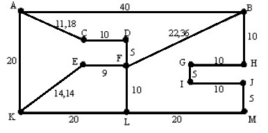
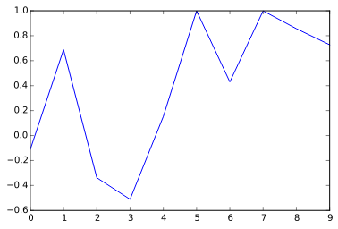
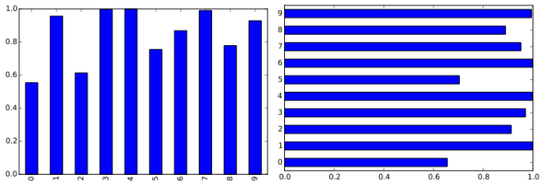
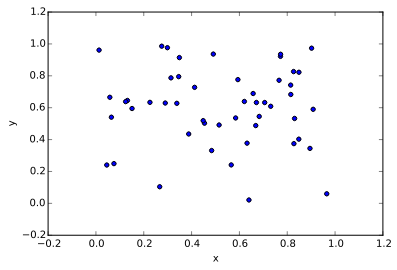
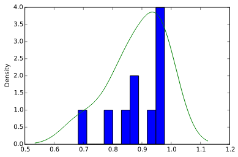

% title: Computação Científica com Python
% subtitle: Introdução e ferramentas
% author: Lincoln de Macêdo
% author: 
% thankyou: Obrigado a todos!
% thankyou_details: 
% contact: www <a href="http://demacdolincoln.gitbub.io">website</a>
% contact: github <a href="http://github.com/demadolincoln">demacdolincoln</a>
% contact: email <a href="mailto:lincoln000@openmailbox.org?subject=Computacao_Cientifica">lincoln000@openmailbox.org</a>
% favicon: 

---
title: Sobre mim
build_lists: true

- Aluno de Licenciatura Plena em Computação
- Membro da comunidade Python de Pernambuco - PUG-PE
- Pesquiso sobre IA desde o 2º período
- Estudo especialmente sobre inteligência de enxame de partículas

---
title: Quem são vocês?

- Curso
- O quanto sabem programar
- Motivações de estar aqui
- Interesses futuros acerca dos assuntos abordados

---
title: Dia 1
subtitle: Breves noções sobre Computação Científica
class: segue dark nobackground

---
title: Computação como ciência 
subtitle: O que fazemos nesta área
build_lists: true

- Foco no método
- Conceitos de outras ciências
- Forte embasamento estatístico e matemático
- Se espalha em diversas categorias:
    + Inteligência Artificial
    + Reconhecimento de padrões
    + Ciência dos dados
    + Computação Quântica
    + ...

---
title: Computação como ciência 
subtitle: Desafios
build_lists: true

- Problemas com solução exponencial X solução polinomial
- Expressar de forma legível procedimentos complexos
- Custo computacional
    + Muitos calculos: exige muito do processador
    + Muitos dados: exige muito de memória
- Precisamos de números aleatórios de qualidade

---
title: Exemplos
subtitle: 
class: segue dark nobackground
 

---
title: MDC

<pre class="prettyprint" data-lang="Python">
def mdc(a, b):
    if b == 0:
        return a
    else:
        return mdc(b, a % b)
</pre>

---
title: Análise Combinatória

Fatorial:

<pre class="prettyprint" data-lang="Python">
def fatorial(n):
    if n == 1:
        return n
    else:
        return n * fatorial(n-1)
    
</pre>

Permutação:

<pre class="prettyprint" data-lang="Python">
def permutacao(a, b):
    return fatorial(a) / fatorial(a - b)
</pre> 

---
title: busca

Gostaria de ter falado aqui sobre diversas situações que envolvem busca, como encontrar o menor caminho (problema do caixeiro viajante), encontrar o melhor parâmetro para determinado algoritmo e questionar, usando exemplos, momentos em que a ordenação otimiza a busca e ao menos dar um exemplo de busca binária, infelizmente o tempo não deixou.

---
title: Dia 2
subtitle: Ferramentas
class: segue dark nobackground

---
title: Manipulação de dados

- Numpy
    * Manipulação de grande volume de dados numéricos com bom desempenho
    * Vale ressaltar:
        + random → módulo com vários métodos para criar valores aleatórios
        + linspace → cria um array de valores aleatórios (muito útil para testes)
        + array → vários recursos que as listas de python não tem
        + muitas expressões prontas

---
title: Pandas

- Análise de dados
- Usa o Numpy e o Matplotlib por baixo dos panos
- Facilidades para plotar gráficos
- Exporta DataFrames até para LaTeX e para xls
- Elementos principais:
    + Series → array de 1 dimensão
    + DataFrame → matrizes de várias dimensões e dicionários

---
title: Bibliotecas científicas

- SciKit Learning (sklearn)
    * Aprendizado de Máquina
- SciPy
    * Pacote de computação científica
    * Quantidade enorme de métodos
    * <a href="http://docs.scipy.org">docs.scipy.org</a>
- SymPy
    * Matemática simbólica
    * Computer Algebra System (CAS)
    * <a href="http://sympy.org">sympy.org</a>

---
title: Visualização de dados

- Matplotlib
    * Excelente documentação
    * Mais usado 
    * <a href="http://matplotlib.org">matplotlib.org</a>
    * Para gráficos em 3d: <a href="http://matplotlib.org/mpl_toolkits/">mpl_toolkits/</a>
- <a href="http://lightning-viz.org/">Lightning Viz</a>

- <a href="http://pyqtgraph.org/">PyQtGraph</a>

---
title: Jupyter

É um conjunto de ferramentas que visa facilitar o ensino e a utilização de algumas ferramentas como as vistas anteriormente, em especial o jupyter notebook, que funciona dentro dos navegadores de internet e pode executar códigos de aproximadamente 40 diferentes linguagens de programação

**jupyterhub:** uma versão do Jupyter notebook para muitos usuários se conectarem no mesmo servidor ao mesmo tempo

* <a href="http://jupyter.org">link:Jupyter</a>

---
title: Dia 3
subtitle: Exercícios
class: segue dark nobackground

---
title: Expressões matemáticas
subtitle: Represente em funções e exiba o gráfico de:

* $F(x) = x^5 - cos(x)$
* $G(x) = sen(x)^\pi$
* $H(x) = log_{10} x * (sen(x)^x)$
* $FoG$ e  $GoF$

<footer class="source"><a href="https://github.com/demacdolincoln/semat">Clique aqui para ver as respostas</a> <footer>

---
title: Represente o grafo abaixo
subtitle: Como você o percorreria de A a M?
class img-top-center

---
title: Extras
subtitle: Tipos de gráficos
class: segue dark nobackground

---
title: Lines
class img-top-center

Entrada: listas (numpy array ou pandas Series)

---
title: Bar | Barh
class img-top-center

Entrada: Listas ou dicionários (pandas Dataframe)

---
title: Scatter
class img-top-center

Entrada: Coordenadas x e y (e z se em 3D), geralmente representadas por duas listas, uma para x e outra para y ou como uma lista de tuplas que contém as coordenadas x e y (depende da ferramenta usada para plotar gráficos)

---
title: Hist | Kde
class img-top-center

Representa a frequência de distribuição de dados, no matplotlib/pandas existem 2 tipos diferentes de gráficos para mesma finalidade:

* hist → faz a representação através de barras
* kde → faz a representação através de linhas contínuas

